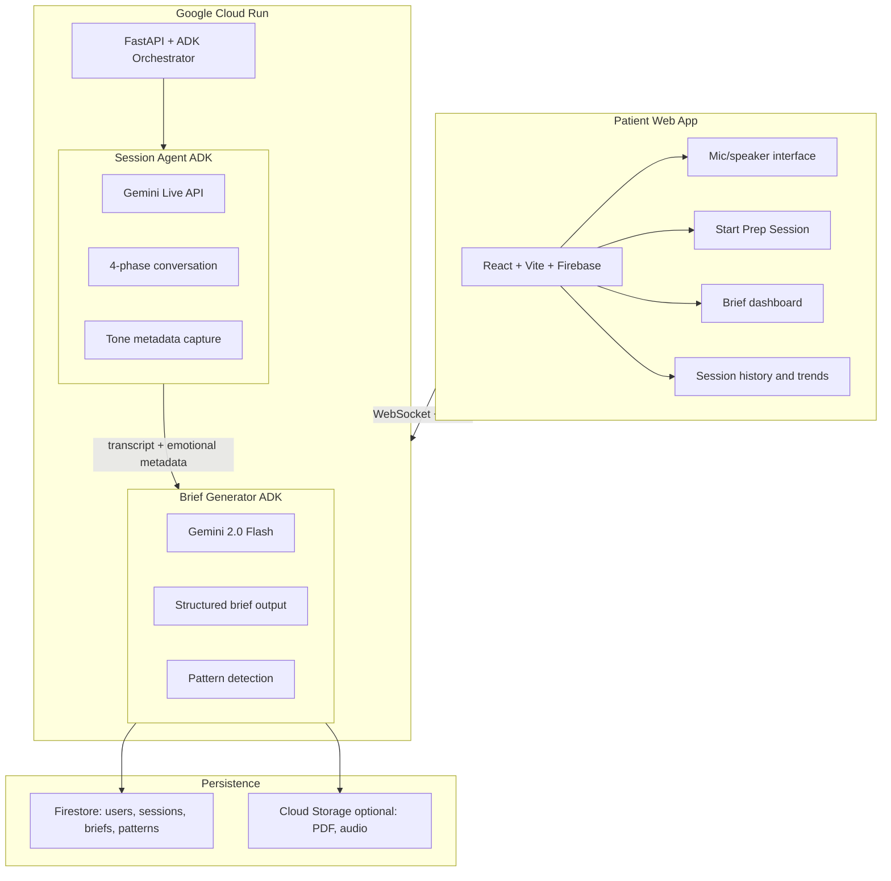
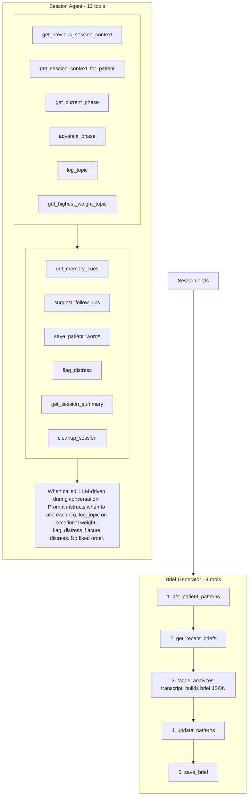

# Prelude — Architecture

System overview and agentic flow (tools and when they are called). For submission PNGs see [architecture-overview.png](architecture-overview.png) and [architecture-agentic-flow.png](architecture-agentic-flow.png). Generate them with `npm run build:diagram` from the repo root. If that fails (e.g. no browser for Puppeteer), copy each Mermaid code block below into [Mermaid Live Editor](https://mermaid.live) and export as PNG.

## 1. System overview

## 2. Agentic flow: tools and when they are called

### Session Agent (12 tools)

| Tool | Role |
|------|------|
| `get_previous_session_context` | Returning patients: prior brief for continuity |
| `get_session_context_for_patient` | Session context at start |
| `get_current_phase` | Current conversation phase and elapsed time |
| `advance_phase` | Transition to next phase |
| `log_topic` | Log topic with emotional weight when patient mentions something significant |
| `get_highest_weight_topic` | Topic with highest weight for deeper exploration |
| `get_memory_cues` | Memory-jog prompts for patient |
| `suggest_follow_ups` | Content-specific follow-up ideas after patient turn |
| `save_patient_words` | Preserve verbatim quote from patient |
| `flag_distress` | Acute distress or self-harm ideation — call immediately |
| `get_session_summary` | Full session state before wrap-up |
| `cleanup_session` | Remove session tracking after completion |

**When called:** LLM-driven during the voice conversation. The session prompt ([backend/prompts/session_prompts.py](../backend/prompts/session_prompts.py)) instructs the model when to use each tool (e.g. “log_topic when patient mentions something with emotional weight,” “advance_phase when ready,” “flag_distress if acute distress”). There is no fixed sequence — the model chooses when to call tools.

### Brief Generator (4 tools)

| Tool | Role |
|------|------|
| `get_patient_patterns` | Recurring theme patterns for patternNote |
| `get_recent_briefs` | Recent briefs for continuity and to avoid repetition |
| `update_patterns` | Update longitudinal pattern tracking with this session’s themes |
| `save_brief` | Persist brief to Firestore |

**When called:** Explicit workflow in [backend/prompts/brief_prompts.py](../backend/prompts/brief_prompts.py): (1) get_patient_patterns, (2) get_recent_briefs, (3) model analyzes transcript and builds brief JSON, (4) update_patterns, (5) save_brief. Order is prescribed; the agent follows this pipeline.

